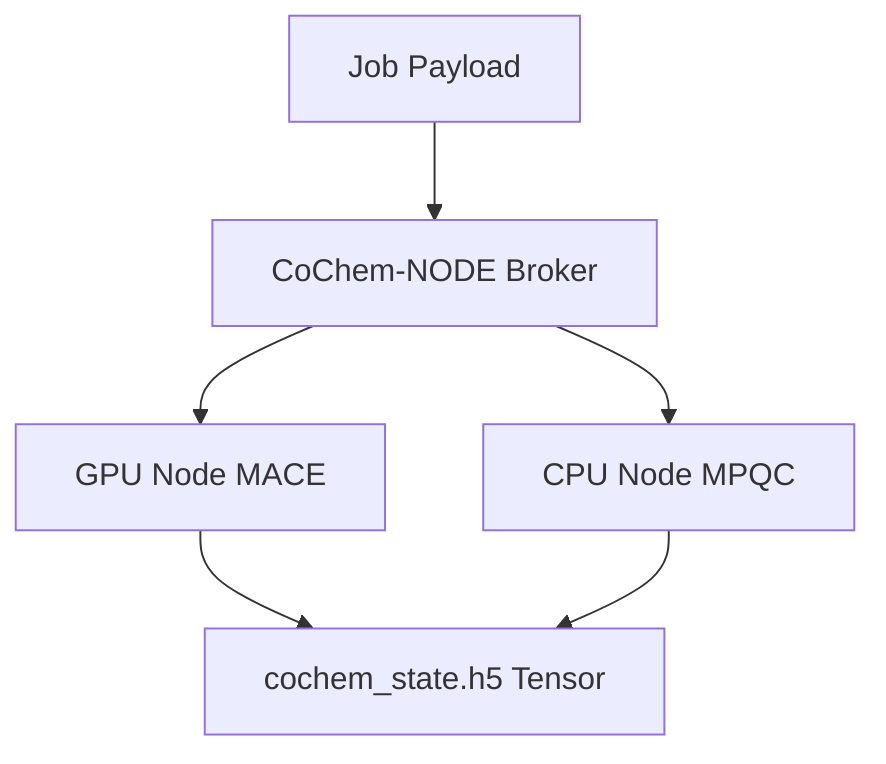

# **CoChem-NODE: Massive HPC Job Dispatch Engine**

**PI/Developer**: Dr. Joshua John Klaassen
**ORCiD**: [https://orcid.org/0009-0007-1506-4401](https://orcid.org/0009-0007-1506-4401)
**GitHub Organization**: [https://github.com/ProfJJK-CoChem](https://github.com/ProfJJK-CoChem)

> **Important**: CoChem has recently migrated to the **Valeev Stack (MPQC, F12)** for its superior scaling across massive compute nodes, enabling optimized distributed calculations `[E]`.

Please refer to the authoritative [CoChem User Manual](https://github.com/ProfJJK-CoChem/CoChem-BASE/blob/main/CoChem_User_Manual.md) and [Method Matrix](https://github.com/ProfJJK-CoChem/CoChem-BASE/blob/main/Method_Matrix.md) for full execution instructions and basis set provenances.

## **Overview**

**CoChem-NODE** is the massive HPC Job Dispatch and Hardware-Scaling engine of the extended CoChem suite. 

It handles:
- Auto-compiling dynamic Slurm (`sbatch`) scripts tailored to hardware resources.
- Managing thousands of independent micro-tasks via an asynchronous ZeroMQ message broker, eliminating traditional polling bottlenecks `[M]`.
- Deploying GPUDirect Storage / NVLink optimizations to stream the massive `cochem_state.h5` tensor across distributed networks via Parallel HDF5.
- Tracking job states, implementing spot-instance checkpoint restarts, and guaranteeing architectural time-tiers via deep telemetry profiling.

## **Architecture**



## **Setup and Installation**

1. Clone the repository on your HPC head node:
   ```bash
   git clone https://github.com/ProfJJK-CoChem/CoChem-NODE.git
   cd CoChem-NODE
   ```
2. Ensure ZeroMQ (`pyzmq`) and `h5py` (with MPI support) are installed.

## **Getting Started**

1. **Configure HPC Registry**:
   Modify `node_config.json` to match your cluster's partition and QoS names.
2. **Launch Broker**:
   ```bash
   python node_broker.py --workers 50
   ```
3. **Submit Jobs**:
   Interact with the NODE broker using standard Python API bindings to dispatch calculation tensors.

---
